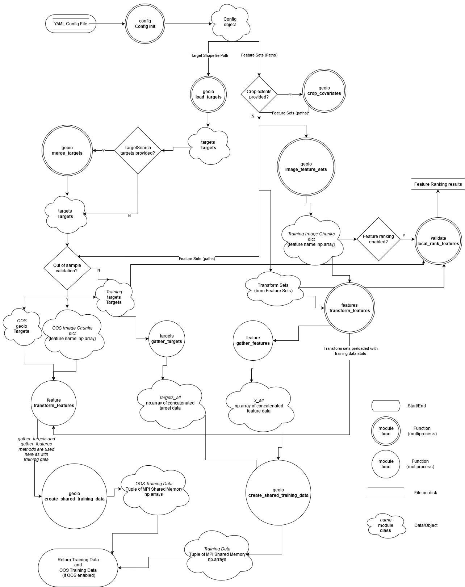
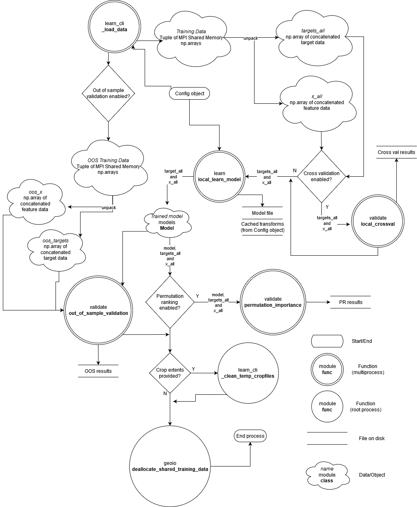
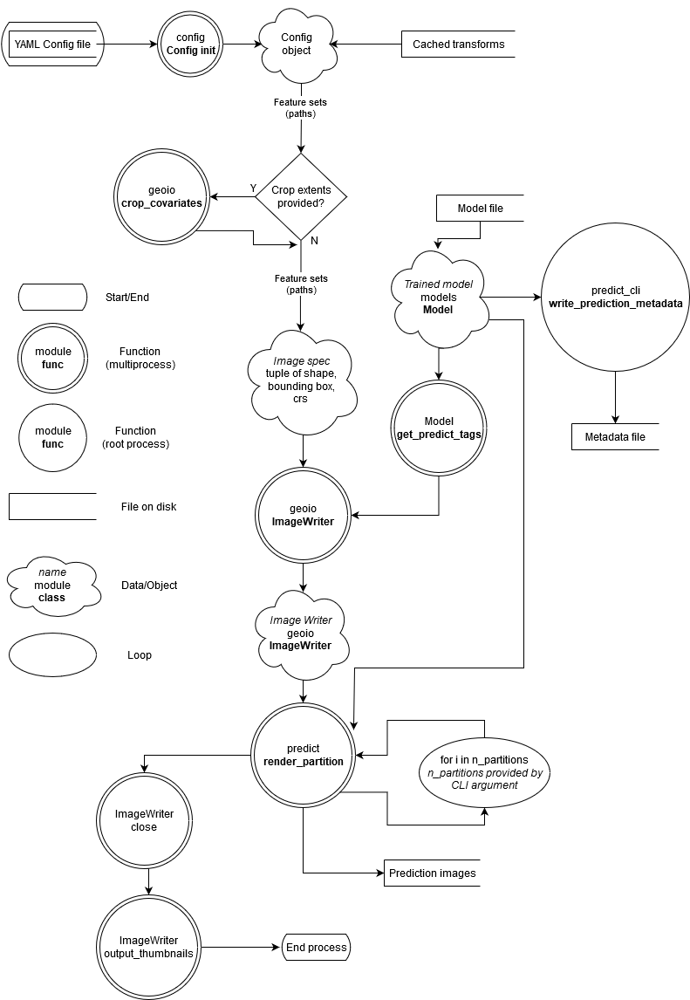

Developer Docs
==============

This section aims to provide some guidance and highlight "gotchas" of 
UncoverML for future developers. It's also recommended to run through
the :ref:`workflows` section.

UncoverML has been developed by a number of different people over the
years, so styles vary, and technical debt has accumulated. I've done
my best to explain the parts of UncoverML I've worked with and 
understand, but some functionality remains undocumented.

Data Flows
----------

These diagrams don't drill all the way down the call stack, but aim to 
give an idea what modules and functions touch the data and in what 
order. The focus is on the learn and predict steps - most other features
in UncoverML follow the same patterns for loading data.

Training Data Preparation
~~~~~~~~~~~~~~~~~~~~~~
The top-level scope containing this data flow is :mod:`uncoverml.scripts.learn_cli._load_data`.
Note pickling isn't covered - if pickled targets/covariates are enabled 
then this data flow doesn't occur. Once the config is loaded the pickled
files are deserialised and returned.

Model Training
~~~~~~~~~~~~~~
The top-level scope containing this data flow is :mod:`uncoverml.scripts.learn_cli.main`.

Prediction
~~~~~~~~~~
The top-level scope containing this data flow is :mod:`uncoverml.scripts.predict_cli.main`.

"Gotchas"
---------
If not considered, these can lead to bugs.

Transform Statistics
~~~~~~~~~~~~~~~~~~~~
It's important to apply the same transforms made to training data to 
your test/prediction data. 
See `this stack exchange post <https://stats.stackexchange.com/questions/361797/standardization-on-training-only-or-also-including-testing-data>`_.

Transforms are in the :mod:`~uncoverml.transforms` package. Transform
classes calculate statistics on the feature data, e.g. for 
standardisation we calculate the mean and standard deviation of the data
so that can standardisation can be formed.

The first time these Transform objects are called, they calculate these
stats and cache them. It's important that these preloaded Transform 
objects are passed to the prediction step so it can transform test 
data based on the stats calculated from the train data.

This is why the :obj:`feature_sets` and :obj:`final_transform` objects
are serialised along with the model at the end of training. They are 
loaded by the prediction step and set as the transforms for prediction.

Because of this, we can't modify feature set or transforms in the YAML
config between learning and predictions steps. Changes to Transforms
won't apply, and if we modify the features then the cached transforms 
won't match up with the provided features.

If cached Transforms aren't supplied, new transform objects will be 
created which will generate stats based on the test/predict data, which
throws off the model results by creating a positive bias (we have 
more information about the unseen data than we should, in the form of
statistics about the data).

Target/Covariate Ordering
~~~~~~~~~~~~~~~~~~~~~~~~~
`x_all` and `targets_all` arrays are passed around Uncoverml, containing
covariate data at each target position.

These arrays are synchronised by positioning. When targets get loaded 
in :meth:`~uncoverml.geoio.load_targets`, they are sorted lexically
by Y, X. They are then intersected with the covariates, and both
arrays maintain this order through the workflow.

If you modify targets or covariates after they are loaded and 
intersected, make sure to maintain this ordering, or at the very least
sort them so they map 1-to-1 positionally.

Hardware Testing
~~~~~~~~~~~~~~~~
Test on multiple processors and with multiple partitions to make sure
your changes produce determinstic results across different hardware
configurations. The Makefile contains a shortcut to do this, which
can be run using:

.. bash::

    make hardware_test
