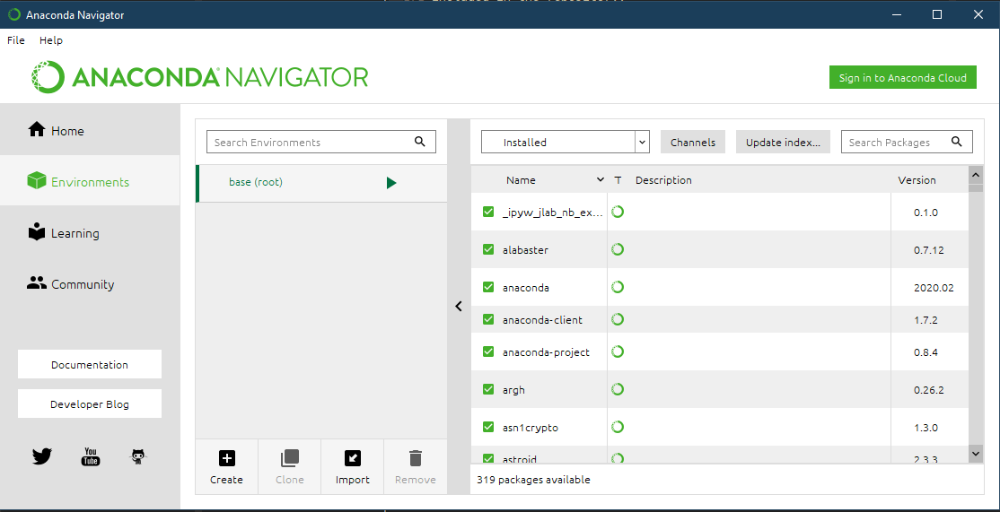
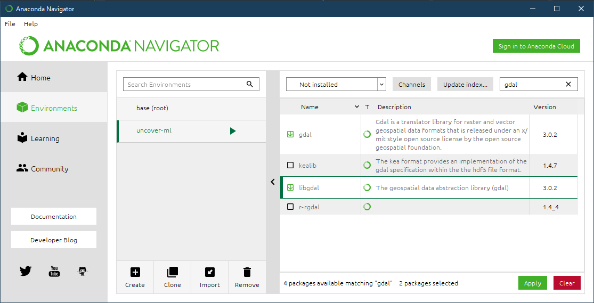

Installation
============

UncoverML requires Python 3.6 or 3.7 on all platforms. 
Python 3.8 is currently untested and not supported.

Ubuntu 18.04
------------

UncoverML supports Ubuntu 18.04 with Python 3.6 or Python 3.7. 

The following instructions may be used for other Linux distributions but the packages and package
manager used may be different. If you require help using UncoverML with a different Linux 
distribution, ask for help on our 
`GitHub Issues <https://github.com/GeoscienceAustralia/uncover-ml/issues>`_ page.

Before installing UncoverML, ensure your OS has the following packages:

- gdal
- openmpi

These can be installed with the following commands:

.. code:: bash

    sudo apt-get install \
        gdal-bin libgdal-dev \
        libblas-dev liblapack-dev \
        libatlas-base-dev libproj-dev \
        gfortran \
        openmpi-bin libopenmpi-dev

It's recommended to use a Python virtual environment (venv) when installing UncoverML. This will
prevent packages that it requires from conflicting with any existing Python environments.

To create a virtual environment, run in your shell:

.. code:: bash

    python3 -m venv /path/to/your/venv

where ``/path/to/your/venv`` is the directory where the venv will exist.

Once created, activate the venv with:

.. code:: bash

    source /path/to/your/venv/bin/activate

You are now ready to install UncoverML. To install from the repository, clone using git:

.. code:: bash

    git clone git@github.com:GeoscienceAustralia/uncover-ml
    cd uncover-ml

By default, the repository will be on the master branch. UncoverML is under heavy development 
at this time and master releases are infrequent. It's recommended to switch to the develop branch
using:

.. code:: bash

    git checkout develop

Before the UncoverML package can be installed, there are some required packages that need to be installed first.

.. code:: bash

    pip install -U pip setuptools
    pip install -r requirements-pykrige.txt

Once these are done, you can install UncoverML with pip:

.. code:: bash

    pip install .

**Alternatively**, you can install the latest stable release from the Python Package Index.
Note you will have install some prerequisites:

.. code:: bash
    
    pip install -U pip setuptools
    pip install Cython==0.29.13
    pip install numpy==1.17.2
    pip install scipy==1.3.1
    pip install matplotlib==3.1.1
    pip install uncover-ml

To ensure the installation has been successful, try running UncoverML against the test data
included in the repository:

.. code:: bash

   uncoverml learn tests/test_data/sirsam/random_forest/sirsam_Na_randomforest.yaml

This will start training a random forest model on the test data. It may take a few minutes.
If the script completes successfully (there will be a log message saying "Finished!") then 
UncoverML has been correctly installed.

This completes the installation. Check out the :ref:`Usage` documentation to get started using
UncoverML.

When you are finished using UncoverML, don't forget to deactivate your virtual environment using:

.. code:: bash

    deactivate

HPC
---

The following instructions refer specifically to NCI's Gadi and Virtual Desktop (VDI), but may be applicable to other
HPC environments running PBS and MPI.

The first step is to unload unrequired and load required system modules. The below are compatible with the VDI (and Raijin, for legacy purposes):

.. code:: bash

    module unload intel-cc
    module unload intel-fc

    module load python3/3.6.2
    module load gdal/2.2.2
    module load openmpi/2.1.1
    module load geos/3.5.0

If you are running on the new Gadi supercomputer, the modules required are different:

.. code:: bash
 
    module load ptython3/3.7.4
    module load gdal/3.0.2
    module load openmpi/2.1.6

For convenience you can place the above commands in your ``~/.bashrc`` (``~/.profile`` on VDI). 
Alternatively, if you already have a configuration in your profile you'd like to preserve but don't
want to type the above commands every time, you can source the ``uncover-ml/pbs/setup_vdi.sh`` or 
``uncover-ml/pbs/setup_gadi.sh`` scripts depending on your platform. 

When using the NCI, a virtual environment is recommended. To create a virtual environment, run in your shell:

.. code:: bash

    python3 -m venv /path/to/your/venv

where ``/path/to/your/venv`` is the directory where the venv will exist.

Once created, activate the venv with:

.. code:: bash

    source /path/to/your/venv/bin/activate

You are now ready to install UncoverML. To install from the repository, clone using git:

.. code:: bash

    git clone git@github.com:GeoscienceAustralia/uncover-ml
    cd uncover-ml

By default, the repository will be on the master branch. UncoverML is under heavy development 
at this time and master releases are infrequent. It's recommended to switch to the develop branch
using:

.. code:: bash

    git checkout develop

Before the UncoverML package can be installed, there are some required packages that need to be installed first.

.. code:: bash

    pip install -U pip setuptools
    pip install -r requirements-pykrige.txt

Once these are done, you can install UncoverML with pip:

.. code:: bash

    pip install .

On the VDI you may have to use ``setup.py`` to install:

.. code:: bash

    python setup.py install

To ensure the installation has been successful, try running UncoverML against the test data
included in the repository:

.. code:: bash

   uncoverml learn tests/test_data/sirsam/random_forest/sirsam_Na_randomforest.yaml

This will start training a random forest model on the test data. It may take a few minutes.
If the script completes successfully (there will be a log message saying "Finished!") then 
UncoverML has been correctly installed.

This completes the installation. Check out the :ref:`Usage` documentation to get started using
UncoverML.

When you are finished using UncoverML, don't forget to deactivate your virtual environment using:

.. code:: bash

    deactivate

Windows 10
----------

UncoverML can be run on Windows 10 with the help of Anaconda. 
This guide is intended for general users, but some steps have extra
notes pertaining to installing on Geoscience Australia Windows devices.

Microsoft MPI is required to use UncoverML on Windows. 
Download MS-MPI from the `MS-MPI website <https://docs.microsoft.com/en-us/message-passing-interface/microsoft-mpi>`_
and install.

You need to install the ``.msi`` and ``.exe`` files.  
Also, add to your ``Path`` environment variable the SDK install location
(by default: ``C:\Program Files (x86)\Microsoft SDKs\MPI``).
Search online for "add Windows 10 Path variable" if unsure how to do this.

.. note:: 
    
    On Geoscience Australia devices, you will need to install MS-MPI via the Software Center
    (may be named MS-MPI SDK or similar).

Download Anaconda from the `Anaconda website <https://www.anaconda.com/products/individual#windows>`_
and install.

.. note::

    On Geoscience Australia devices, you will need to install Anaconda from the Software Center.

Once installed, open the Anaconda navigator and create a new environment:

- Select 'Environments' in left sidebar
- At the bottom of the screen, select 'Create'

.. _install_anaconda_packages::

We'll use Anaconda to install some required packages:

- Select the environment you have just created
- In the package list window, select 'Not installed' from the filter 
  drop down menu
- Type 'gdal' into the search bar and click 'Update index...'
- Once the packages have been found, select the checkboxes for 'gdal'
  and 'libgdal' and click 'Apply'. A window will display showing required
  dependencies to install. Accept these and continue.

Repeat the above process for the following packages ('Update index...' doesn't need to be clicked again):

- rasterio
- fiona

Once complete, open a terminal with your environment activated by clicking the right-facing arrow
next to your environment name and selecting 'Open Terminal'.

Install the MPI Python library:

- In the terminal, run:

.. code:: bash

    conda install -c intel mpi4py

Now clone the UncoverML repository:

.. note:: 

    Cloning the repository can be done through Git Bash or your 
    preferred git client. In this case it's done through the Windows
    CMD terminal for convenience.

- Navigate to your desired directory

  - ``<DRIVE_LETTER>:`` will change drives in the Windows CMD terminal and
    ``cd <path>`` will change directories. 

- Clone the repository using `git clone https://github.com/GeoscienceAustralia/uncover-ml.git`

  - If you do not have git installed, you can install it using Anaconda navigator 
    using the :ref:`method above <install_anaconda_packages>`

- Once cloned, cd into the repository using ``cd uncover-ml``
- By default, the repository will be on the master branch. UncoverML is under heavy development 
  at this time and master releases are infrequent. It's recommended to switch to the develop branch
  using ``git checkout develop``

Pip can now be used to install UncoverML into our Anaconda environment:

- In the terminal, run:

.. code:: bash

  pip install -r requirements-pykrige.txt
  pip install . 

UncoverML will now be installed in your Anaconda environment.

To test that it's operational, run the included Windows test config:

- Modify the example config to point to your uncover-ml repository so that the test data can be
  found:

  - Open ``...\uncover-ml\configs\windows_random_forest.yaml`` in a text editor and modify the 
  section of the file paths on lines 13, 20, 35 and 41 that contain ``path\to\uncoverml``
  to the path to where you cloned the uncover-ml repository. For example, if I cloned
  the repository to ``C:\Users\bmous`` then this would become ``C:\Users\bmous\uncover-ml\rest-of-path``

- In the terminal, run:

.. code:: bash

    uncoverml learn configs\windows_random_forest.yaml

This trains a multirandomforest model on some test data

- In the terminal, run:

.. code:: bash

  uncoverml predict configs\windows_random_forest.yaml

This performs a prediction on the test data using the trained model

If the installation and execution was successful, then the results will be available
in ``...path to uncover-ml repository\random_forest_out``.

On Windows, multiprocessing can be utilised by running UncoverML commands using ``mpiexec``:

.. code:: bash

    mpiexec -n 4 uncoverml learn configs\windows_random_forest.yaml

Where ``-n 4`` specifies to run the training with 4 processors.

With that the installation is complete. Read the documentation further to learn how to
fully utilise UncoverML. When you want to run UncoverML on Windows, make sure to launch
a terminal from Anaconda Navigator using your UncoverML environment.

.. note:: 

    You may get a Windows firewall warning asking for exceptions for mpiexec and
    Hydra proxy. These can be safely canceled. The networking requirement of 
    MPI will work on local machines without setting firewall rules.

.. warning::

    The Cubist functionality is currently not available when using Windows.
    This requires further work in making Cubist compatible with Windows and 
    writing a Cubist install script for Windows.
