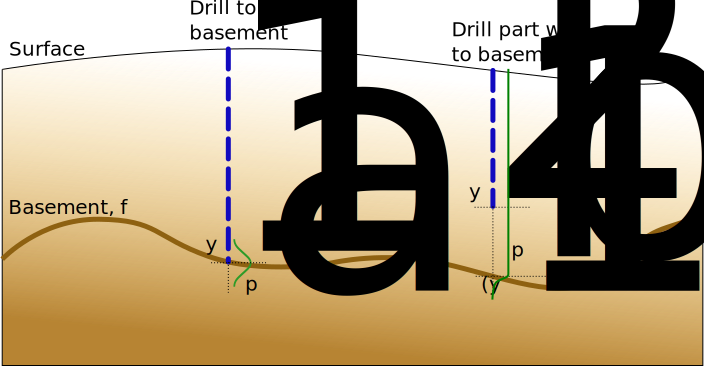

Uncover-ML project report
=========================

This page contains a brief report on some of the aspects of the uncover ml GA
project not covered by the documentation.

.. contents::

Revrand - large-scale approximate Gaussian processes
----------------------------------------------------

The main algorithm used from revrand_ is the standard linear model for
regression. The aim is to learn a function that maps input covariate values,
:math:`\mathbf{x}_n \in \mathbb{R}^d`, to target values, :math:`y_n \in
\mathbb{R}`. That is, learn :math:`f` such that :math:`y_n = f(\mathbf{x}_n) +
\epsilon`, where :math:`\epsilon` is random (Gaussian) noise. The standard
linear model represents :math:`f` as a linear combination of (non-linear)
*basis* functions, :math:`f(\mathbf{x}_n) = \phi(\mathbf{x}_n, \theta)^\top
\mathbf{w}`, where :math:`\phi: d \to D`, with weights :math:`\mathbf{w} \in
\mathbb{R}^D`. The exact form of the model implemented in revrand is,

.. math::
    
    \text{Likelihood:}& \quad
    \mathbf{y} \sim \prod^N_{n=1} \mathcal{N}(\phi(\mathbf{x}_n)^\top 
        \mathbf{w}, \sigma^2),

    \text{Prior:}& \quad
    \mathbf{w} \sim \mathcal{N}(\mathbf{0}, \lambda \mathbf{I}_D),

We then maximise the *log marginal likelihood* of the model to learn the
parameters :math:`\sigma^2, \lambda` and :math:`\theta` from the data (without
over fitting). We can then solve for the posterior over the weights,

.. math::

    \mathbf{w} | \mathbf{y}, \mathbf{X} \sim& \mathcal{N}(\mathbf{m},
        \mathbf{C}),

    \mathbf{C} =& [\lambda^{-1}\mathbf{I}_D + \sigma^{-2}\phi(\mathbf{X})^\top
        \phi(\mathbf{X})]^{-1},

    \mathbf{m} =& \frac{1}{\sigma^2} \mathbf{C} \phi(\mathbf{X})^\top
        \mathbf{y}.

The predictive distribution given a query point, :math:`\mathbf{x}^*` is,

.. math::
    
    p(y^*|\mathbf{x}^*, \mathbf{y}, \mathbf{X}) =& \int
        \mathcal{N}(y^* | \phi(\mathbf{x}^*)^\top \mathbf{w}, \sigma^2)
        \mathcal{N}(\mathbf{w} | \mathbf{m}, \mathbf{C}) d\mathbf{w}

        =& \mathcal{N}\!\left(y^* | \phi(\mathbf{x}^*)^\top \mathbf{m},
            \sigma^2 + \phi(\mathbf{x}^*)^\top \mathbf{C} \phi(\mathbf{x}^*)
            \right).

This model can learn from large datasets, unlike a Gaussian process, which
needs to invert a matrix the dimension of the learning dataset. A Gaussian
process is in general more flexible than the above model, as it specifies a
prior directly over functions as opposed to weights (:math:`\mathbf{f} \sim
\mathcal{N}(\mathbf{0}, \mathbf{K})`, where :math:`\mathbf{K}` is a kernel
matrix). However, the trick implemented in revrand is that by choosing special
types of basis functions (:math:`\phi(\cdot)`) we can approximate the behaviour
of Gaussian processes.  See [1]_ and [2]_ for more information.

We can also use this model to estimate the expected reduction in entropy of the
posterior distribution over the weights from incorporating a query point into
the model,

.. math::

    H[\mathbf{w}] - H[\mathbf{w}|\mathbf{x}^*] = \frac{1}{2} \left[ 
        \log \left( \sigma^2 
        + \phi(\mathbf{x}^*)^\top \mathbf{C} \phi(\mathbf{x}^*) \right) 
        - \log(\sigma^2) \right]

This will tell us where to take future measurements to maximally reduce the
model uncertainty. It is worth noting that this quantity is very similar to the
predictive variance.

Heterogeneous drill observations
--------------------------------

While we did not have time to implement an algorithm to use heterogeneous drill
holes types, i.e. those that do and do not hit the basement, we did establish a
model for incorporating these observations. The basis for this model is a
conditional likelihood model that changes the distribution used depending on
the type of drill hole.

The purpose of a likelihood model is to model the process arising from 
measurement error, that is, what is the probability of a measurement given the
true value? In this instance the true value is the depth of the basement,
:math:`f_n`, at a point :math:`n`, we then acquire a noisy measurement of this
basement from our drill-rig, :math:`y_n`. The likelihood model then describes
the probability :math:`p(y_n | f_n)`.

In this situation we have effectively two different methods of acquiring
measurements, direct observations of the basement layer, and a depth that we
know the basement must lie below. Hence, we need different likelihood models
for each of these "sensors". For the first, where the drill has hit basement,
we can simply use a Gaussian measurement error model. For the second, we know
that there is non-zero probability of the drill encountering basement between
the ground, and the basement. We don't know the reason for stopping the
drilling before the basement, and so we can put a uniform distribution on this
measurement between the surface and the basement. However we know that we are
unlikely to drill past the basement (otherwise this is the first type of
measurement), and so we put a steep Gaussian falloff after the basement layer,
as we have depicted in the following image

The formulation of the actual likelihood and prior is as follows, recall
:math:`f_n := f(\mathbf{x}_n) = \phi(\mathbf{x}_n)^\top \mathbf{w}`,

.. math::
    
    \text{Likelihood:}& \quad
    \mathbf{y} | \mathbf{z}, \mathbf{w} \sim \prod^N_{n=1}
            \mathcal{N}(f_n, \sigma^2)^{z_n}
            p_{z_n=0}(f_n, l^2)^{1 - z_n},

    \text{Prior:}& \quad
    \mathbf{w} \sim \mathcal{N}(\mathbf{0}, \lambda \mathbf{I}_D).

Here :math:`z_n` is an indicator variable that is 1 if an observation has hit
the basement, and so uses a Gaussian measurement error model, or 0 if the
basement was not hit, and so uses a piecewise modified uniform measurement
model,

.. math::

    p_{z_n=0}(y_n | f_n, l^2) = 
    \begin{cases}
    \frac{1}{f_n + l \sqrt{(\pi/2)}} 
        & \text{if}~y_n \leq f_n~\text{and}~f_n > 0, \\
    \frac{1}{f_n + l \sqrt{(\pi/2)}} e^{-\frac{(y_n - f_n)^2}{2 l^2}} 
        & \text{if}~y_n > f_n~\text{and}~f_n > 0, \\
    \frac{1}{l \sqrt{(\pi/2)}} e^{-\frac{(y_n - f_n)^2}{2 l^2}} 
        & \text{if}~f < 0.
    \end{cases}

The first condition models the case where the observation occurs above the
basement (most likely scenario). The second condition models the case where the
basement is above the measurement, which is very unlikely. The third condition
models the case where the basement is above the surface and our observation is
below the surface. Again this condition is very unlikely, but it is included in
the likelihood mainly as a way to constrain inference of :math:`f_n` to be
below the surface and below :math:`y_n`. Here :math:`l` is a scale parameter
which is set a-priori to penalise the model for placing the basement above
observations that do not impact the basement.

Inference in this model is more difficult than in the standard linear model,
however there is an implementation of a *generalised* linear model in revrand,
that can be easily extended to use this compound likelihood.

References
----------

.. _revrand: http://github.com/NICTA/revrand

.. [1] Yang, Z., Smola, A. J., Song, L., & Wilson, A. G. "A la Carte --
   Learning Fast Kernels". Proceedings of the Eighteenth International
   Conference on Artificial Intelligence and Statistics, pp. 1098-1106,
   2015.
.. [2] Rasmussen, C. E., & Williams, C. K. I. "Gaussian Processes for Machine
   Learning", MIT Press, 2006.
.. [3] Rahimi, A., & Recht, B. "Random features for large-scale kernel
   machines." Advances in neural information processing systems. 2007. 
.. [4] Gershman, S., Hoffman, M., & Blei, D. "Nonparametric variational
   inference". arXiv preprint arXiv:1206.4665 (2012).
