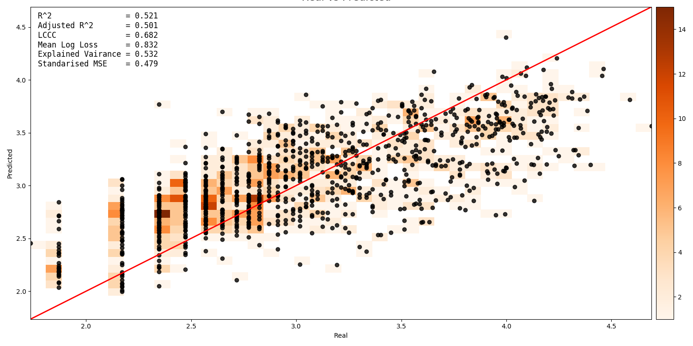

Usage
=====

Running locally
---------------

UncoverML uses MPI for parallelization on localhosts and on clusters/high
performance computers. Here is an example of running the pipeline from the
command line,

.. code:: console

  $ mpirun -n 4 uncoverml learn -p 10 config.yaml

Breaking this down,

- `mpirun -n 4` instructs MPI to use four processors for the pipeline
- `uncoverml learn -p 10 config.yaml` runs the learning pipeline (i.e. learns a
  machine learning model). The `-p 10` flag makes 10 chunks of work for the
  four workers (this is to limit memory usage, more chunks, less memory usage),
  and the `config.yaml` is the configuration file for the pipeline.

Similarly, there are two more options,

.. code:: console

  $ mpirun -n 4 uncoverml predict -p 10 config.yaml

Which uses the learned model from the previous command to predict target values
for all query points, and

.. code:: console

  $ mpirun -n 4 uncoverml cluster config.yaml

Which clusters (unsupervised) all of the data.

Running on HPC
--------------

In the ``pbs`` directory of the repository there are some example scripts and a helper function
to assist launching batch jobs over multiple nodes with PBS.

.. todo::
    
    The PBS scripts and examples are outdated and need to be fixed.

UncoverML uses MPI for parallelization. To run an uncoverml command, use:

.. code:: bash

    mpirun -n <number_of_processors> <command>

An example of PBS job submission script:

.. code:: bash

    #!/bin/bash
    #PBS -P ge3
    #PBS -q normal
    #PBS -l walltime=01:00:00,mem=128GB,ncpus=32,jobfs=20GB
    #PBS -l wd

    # setup environment
    module unload intel-cc
    module unload intel-fc
    module load python3/3.4.3 python3/3.4.3-matplotlib 
    module load load hdf5/1.8.10 gdal/2.0.0
    source $HOME/.profile

    # start the virtualenv
    workon uncoverml

    # run command
    mpirun --mca mpi_warn_on_fork 0 uncoverml learn national_gamma_no_zeros.yaml -p 10
    mpirun --mca mpi_warn_on_fork 0 uncoverml predict national_gamma_no_zeros.model -p 40

where in this case mpirun is able to determine the number of available cores via PBS. This job 
submits the ``learn`` and ``predict`` jobs one after the other. The `-p 10` or `-p 40` options 
partitions the input covariates into the specificed number of memory partitions.

For more information on configuring PBS jobs on Raijin, view the 
`NCI user documentation <https://opus.nci.org.au/display/Help/Raijin+User+Guide>`_. 

.. include:: workflows.rst

Models
------

For an overview of the models available in UncoverML, view the module
documentation: :mod:`uncoverml.models`.

.. _outputs:

Outputs
-------

.. _diagnostics:

Diagnostics
-----------

Covariate Correlation
~~~~~~~~~~~~~~~~~~~~~
This generates a correlation matrix showing correlation between provided
covariates. The color/value of each square shows how strong the positive
or negative correlation is:

.. image:: sirsam_Na_randomforest_correlation.png
  :alt: Covariate correlation matrix.

To generate a correlation matrix, the ``learn`` command must be run
so that ``rawcovariates.csv`` is generated, and ``plot_correlation``
must be set to ``True`` in the configuration.

Feature Ranking
~~~~~~~~~~~~~~~
The result of feature ranking can be plotted. This creates two plots.
One is a grouped bar chart - each colored bar represents a metric,
the Y-axis is the score of that metric and each group is a feature 
(AKA covariate):

.. image:: sirsam_Na_randomforest_featureranks.png

The other plot is a series of curves. Each curve represents a metric,
with scores on the Y-axis and covarites on the X-axis. Each inflection
represents what happens to the score when the corresponding covariate
is removed from the model:

.. image:: fr_curve.png

To generate feature rank plots, the ``learn`` command must be run
with ``feature_rank`` set to ``True`` under the ``validation`` block
of the config, and ``plot_feature_ranks`` set to ``True``.

Covariate Intersection
~~~~~~~~~~~~~~~~~~~~~~
Covariate intersection can be plotted. These scatter plots, one for
each covariate, show the corresponding covariate value for each target
value:

.. image:: intersection.png

To generate intersection plots, the ``learn`` command must be run
so that ``rawcovariates.csv`` is generated, and ``plot_intersection``
must be ``True`` in the configuration.

Real vs. Prediction
~~~~~~~~~~~~~~~~~~~
A scatter plot showing the intersection between real vs. predicted values
can be generated. This comapres the values predicted by the model
to the actual target values, and is important for validating model.
It includes several pieces of information. The points show the intersecting
values. The 2D histogram in the background shows grouping of the points
(the colorbar on the right-hand side codes the frequency of each grouping).
The text in the upper-left shows the score from the metrics generated
by cross-validation:

A histogram of residual error is also generated. This shows bins grouping
the residual error between intersected points (i.e. the difference between
a predicted value and the corresponding real value):

.. image:: sirsam_Na_randomforest_residual.png

To generate a real vs. prediction plot, ``k-fold`` must be enabled
under the ``validation`` block of the config, and ``plot_real_vs_pred``
must be set to ``True``.

Target Scaling
~~~~~~~~~~~~~~
A histogram of target scaling can be generated. This shows the distribution
of the target data pre- and post-scaling:

.. image:: sirsam_Na_randomforest_target_scaling.png

To generate a target scaling histogram, run ``learn`` with ``plot_target_scaling``
set to ``True``.

Command Line Interface
----------------------

UncoverML has several command line options. Select an option below to 
view its documentation:

.. include:: scripts.rst
