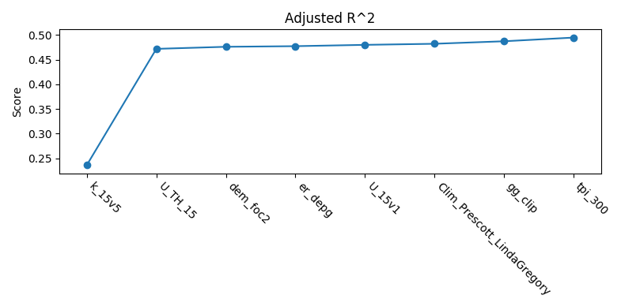
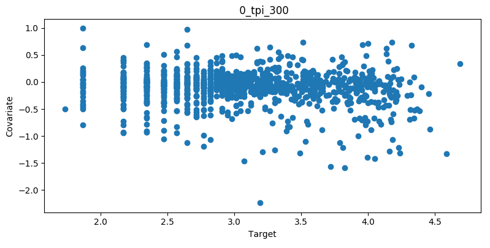

Usage
=====

Running
-------
UncoverML has three main commands. The `learn` command will train a new
model based on the provided config:

.. code:: console
  
  uncoverml learn config.yaml

If performing K-Means clustering, the model is generated by running the
`cluster` command:

.. code:: console

  uncoverml cluster config.yaml

After training a model, a prediction can be performed by running the 
`predict` command:

.. code:: console

  uncoverml predict config.yaml

To get you started, there are some demonstration config files located
at `uncover-ml/configs`, which will allow the training of models on 
very small set of built-in example data. 

For an in-depth explanation of config files, see :ref:`configuration`.

Multiprocessing
---------------

UncoverML uses MPI for parallelization on localhosts and on clusters/high
performance computers. Here is an example of running the pipeline from the
command line,

.. code:: console

  $ mpirun -n 4 uncoverml learn -p 10 config.yaml

Breaking this down,

- `mpirun -n 4` instructs MPI to use four processors for the pipeline
- `uncoverml learn -p 10 config.yaml` runs the learning pipeline (i.e. learns a
  machine learning model). The `-p 10` flag makes 10 chunks of work for the
  four workers (this is to limit memory usage, more chunks, less memory usage),
  and the `config.yaml` is the configuration file for the pipeline.

Similarly, there are two more options,

.. code:: console

  $ mpirun -n 4 uncoverml predict -p 10 config.yaml

Which uses the learned model from the previous command to predict target values
for all query points, and

.. code:: console

  $ mpirun -n 4 uncoverml cluster config.yaml

Which clusters (unsupervised) all of the data.

Running on HPC
--------------

In the ``scripts`` directory of the repository there are some example configs and an example
script, ``job_submit_example.sh``, to assist launching batch jobs over multiple nodes with PBS.

UncoverML uses MPI for parallelization. To run an uncoverml command, use:

.. code:: bash

    mpirun -n <number_of_processors> <command> -p <number_of_data_partitions>

Using more processors for a job will typically reduce the processing time.
The `-p` option will partition data into the specified number of chunks.
This is useful for dealing with larger-than-memory datasets. Try experimenting
with this option if you experience out-of-memory errors.

.. todo::

    Change below link to Gadi User Guide when it becomes available.

For more information on configuring PBS jobs on Raijin, view the 
`NCI user documentation <https://opus.nci.org.au/display/Help/Raijin+User+Guide>`_. 

.. _configuration:

Configuration
-------------

.. include:: workflows.rst

Models
------

For an overview of all the models available in UncoverML, view the module
documentation: :mod:`uncoverml.models`. 

.. _outputs:

Outputs
-------

UncoverML produces a number of outputs. This section explains what
they are.

Learn
~~~~~
* ``rawcovariates.csv``: a table containg the value from each covariate
  and the target value for a given point. This is before any scaling or
  transforms are applied.

* ``rawcovariates_mask.csv``: a table representing the mask for each
  point, i.e. which coviarates are missing from which coordinates. *Note:* 
  I think this is currently broken.

* ``transformed_targets.csv``: a table containing untransformed target
  values in the first column and the transformed value in the other column.

* ``crossval_scores.json``: a simple JSON dictionary containing the scores
  for each metric evaluated by cross-validation.

* ``crossval_results.csv``: a table containing real target values in the
  first column and the corresponding prediction from cross-validation
  in the other column.

* ``featureranks.sjon``: a JSON file containing the results of feature ranking.
  The 'ranks' dictionary contains covariates grouped by metric and ordered
  by performance (i.e. how much impact that covariate had on the model
  when removed) and 'scores' contains the corresponding numerical score.

* ``*.model``: a Python binary file containing data related to the trained
  model. This does not need to be accessed directly but does need to be
  provided as part of the ``predict`` step. 

* ``features.pk`` and ``targts.pk``: Python binary files containing 
  preprocessed targets and covariates. These shouldn't be accessed directly
  and are part of the ``pickling`` block of the configuration.

Predict
~~~~~~~
A number of maps as GeoTIFF files will be generated - there will be
one map for each band requested as output in the configuration file.
The map will be named after the band, e.g. ``prediction.tif`` for the
main prediction band. Downsampled versions of the maps will also be
generated for use as thumbnails.

.. _diagnostics:

Diagnostics
-----------

Covariate Correlation
~~~~~~~~~~~~~~~~~~~~~
This generates a correlation matrix showing correlation between provided
covariates. The color/value of each square shows how strong the positive
or negative correlation is:

.. image:: sirsam_Na_randomforest_correlation.png
  :alt: Covariate correlation matrix.

To generate a correlation matrix, the ``learn`` command must be run
so that ``rawcovariates.csv`` is generated, and ``plot_correlation``
must be set to ``True`` in the configuration.

Feature Ranking
~~~~~~~~~~~~~~~
The result of feature ranking can be plotted. This creates two plots.
One is a grouped bar chart - each colored bar represents a metric,
the Y-axis is the score of that metric and each group is a feature 
(AKA covariate):

.. image:: sirsam_Na_randomforest_featureranks.png

The other plot is a series of curves. Each curve represents a metric,
with scores on the Y-axis and covarites on the X-axis. Each inflection
represents what happens to the score when the corresponding covariate
is removed from the model:

To generate feature rank plots, the ``learn`` command must be run
with ``feature_rank`` set to ``True`` under the ``validation`` block
of the config, and ``plot_feature_ranks`` set to ``True``.

Covariate Intersection
~~~~~~~~~~~~~~~~~~~~~~
Covariate intersection can be plotted. These scatter plots, one for
each covariate, show the corresponding covariate value for each target
value:

To generate intersection plots, the ``learn`` command must be run
so that ``rawcovariates.csv`` is generated, and ``plot_intersection``
must be ``True`` in the configuration.

Real vs. Prediction
~~~~~~~~~~~~~~~~~~~
A scatter plot showing the intersection between real vs. predicted values
can be generated. This comapres the values predicted by the model
to the actual target values, and is important for validating model.
It includes several pieces of information. The points show the intersecting
values. The 2D histogram in the background shows grouping of the points
(the colorbar on the right-hand side codes the frequency of each grouping).
The text in the upper-left shows the score from the metrics generated
by cross-validation:

.. image:: sirsam_Na_randomforest_real_vs_pred.png

A histogram of residual error is also generated. This shows bins grouping
the residual error between intersected points (i.e. the difference between
a predicted value and the corresponding real value):

.. image:: sirsam_Na_randomforest_residual.png

To generate a real vs. prediction plot, ``k-fold`` must be enabled
under the ``validation`` block of the config, and ``plot_real_vs_pred``
must be set to ``True``.

Target Scaling
~~~~~~~~~~~~~~
A histogram of target scaling can be generated. This shows the distribution
of the target data pre- and post-scaling:

To generate a target scaling histogram, run ``learn`` with ``plot_target_scaling``
set to ``True``.

Command Line Interface
----------------------

UncoverML has several command line options. Select an option below to 
view its documentation:

.. include:: scripts.rst
