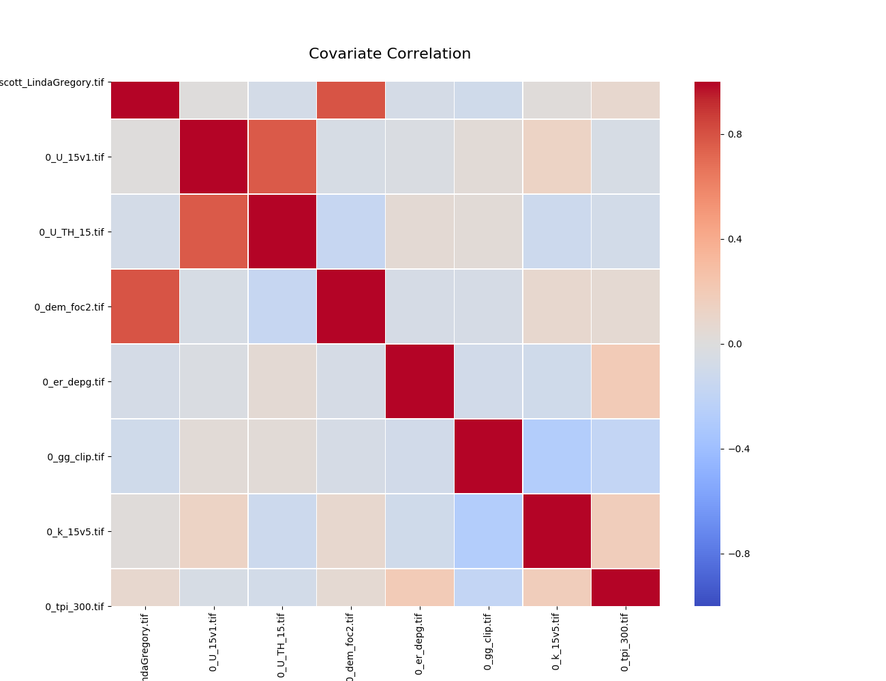
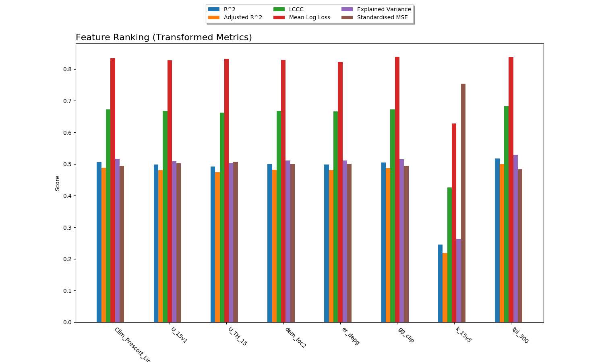
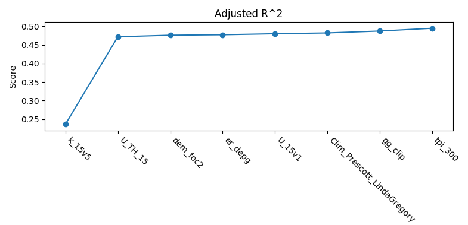
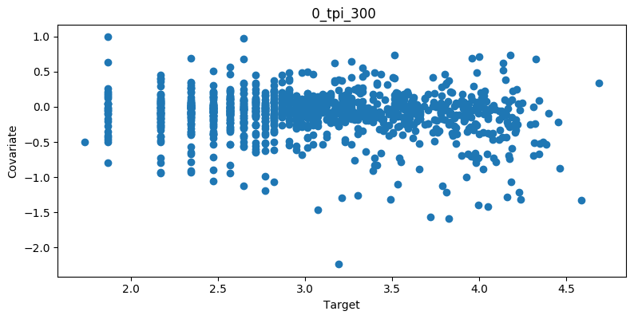
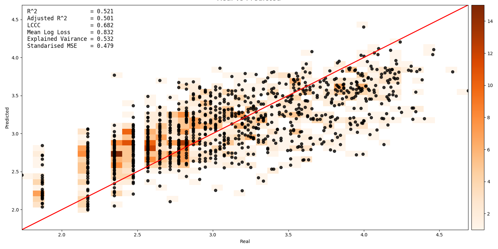
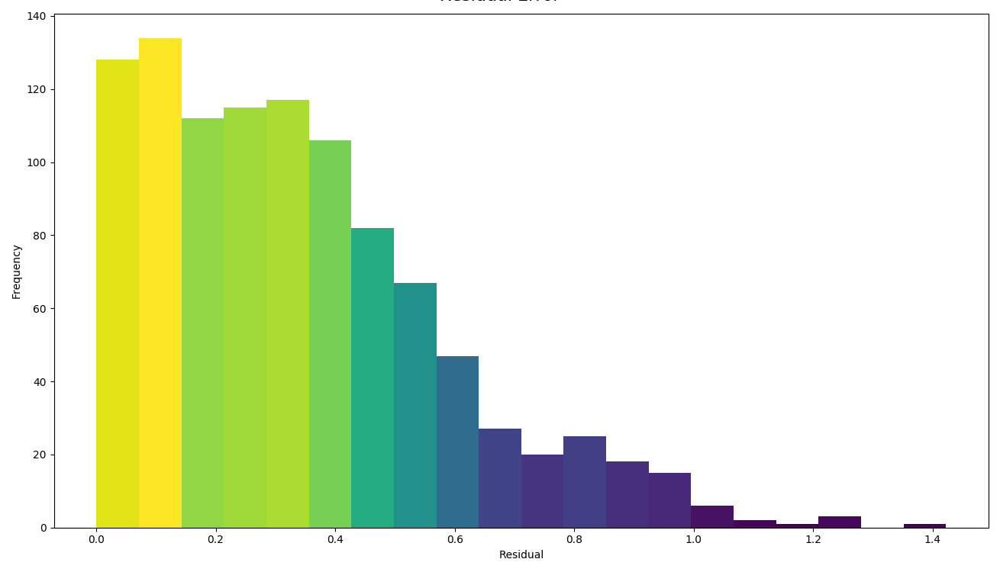

Workflows
=========

UncoverML workflows are controlled by a YAML configuration file.
This section provides some examples and explanations of different 
workflows, the required configuration, uncoverml commands and the
produced outputs

There some example YAML files in the *uncover-ml/configs* directory
to help you get started.

.. _learn_and_predict:

Learn and Predict
-----------------

The most common task in UncoverML is using it train a model and then
perform a prediction. This requires:

- A config file with necessary parameters
- A set of geotiffs containing covariate/feature data
- A shapefile containing training targets

Config
~~~~~~

An example of a learn/predict config:

.. code:: yaml
 
  learning:
    algorithm: transformedrandomforest
    arguments:
      n_estimators: 10
      target_transform: log

  features:
    - type: ordinal
      files:
        - directory: path/to/covariates/directory
      transforms:
        - centre
        - standardise
      imputation: mean

  targets:
    file: path/to/training/target/shapefile
    property: Na_log

  prediction:
    quantiles: 0.95
    outbands: 4

  output:
    directory: path/to/store/output

The ``learning`` block specifies the algorithm/model to train:

- ``algorithm``: the name of the algorithm 
- ``arguments``: a dictionary of keyword arguments specific to that  
  algorithm. See *models page* for available algorithms and links to 
  their documentation to understand what parameters are available for
  each algorithm.

  - ``target_transform``: this argument is specific to UncoverML and an
    addition to the algorithm's base arguments. Target values will be 
    transformed using this method before being passed to the algorithm's
    ``fit`` and ``predict`` methods.

    - ``identity``: identity transform - does nothing to the data. This
      is the default option if ``target_transform`` is not provided.
    - ``standardise``: applies a standarisation transform.
    - ``sqrt``: applies a square root transform.
    - ``log``: applies a log10 transform.
    - ``logistic``: applies a logistic transform.
    - ``rank``: apply a RankGauss transform.
    - ``kde``: apply a KDE transform.

The ``features`` block contains the features/covariates to be used for 
training and prediction:

- ``type``: UncoverML supports ordinal and categorical data, but they 
  must be provided in separate sets and the ``type`` must be provided 
  (if no type is provided, UncoverML will assume the data is ordinal). 
- ``files``: The location of the geotiffs. Multiple entries can be
  provided for ``files`` and can be of type ``directory``, ``path``
  or ``list``

  - ``directory``: Path to a directory. All geotiffs within this 
    directory will be loaded as features.
  - ``path``: Path to a geotiff file. This will be loaded as a feature.
  - ``list``: Path to a text file. Each line of the text file is a path
    to a geotiff and geotiff will be loaded as a feature.

- ``transforms``: Transforms to use for scaling features. Multiple
  transforms can be applied to each set of features specified.

    - ``centre``: applies a centre transform (demeans the data).
    - ``standardise``: applies a standarisation transform.
    - ``log``: applies a log10 transform.
    - ``sqrt``: applies a square root transform.
    - ``whiten``: applies a Whiten transform.
    - ``onehot``: performs OneHot encoding
    - ``randomhot``: performs RandomHot encoding.

- ``imputation``: the imputer to use for filling missing values in the 
  provided features.

  - ``mean``: mean imputation.
  - ``gauss``: Gauss imputation.
  - ``nn``: nearest neighbour imputation.

*Geotiffs must be the same size and resolution, otherwise an exception
will be raised.*

Multiple feature sets can be specified for different types of data, or
for applying different transforms:

.. code:: yaml

  features:
    - type: categorical
      files:
        - path: path/to/categorical/feature
      transforms:
        - onehot
    - type: ordinal
      files:
        - list path/to/feature/list.txt
      transforms:
        - standardise
      imputation: nn

The ``targets`` block specifies the training targets to be used:

- ``file``: path to the shapefile containing training targets
- ``property``: name of the field in the shapefile to be used as 
  training value

*At least some of the targets in the shapefile must intersect with the
provided features. Targets outside of the feature area will be 
ignored*

The ``prediction`` block specifies what outbands to generate and the
quantile interval for producing upper and lower quantile maps:

- ``quantiles``: a value between 0 and 1 representing the prediction
  interval. E.g. '0.95' means the predicted values will fall within
  the lower and upper quantiles 95% of the time.
- ``outbands``:  each band will be written as a separate
  geotiff file. For classification, the available outbands is equivalent
  to the available classes. For regression, the first outband is 
  prediction and if the model provides them, the next are variance, 
  lower quantile and upper quantile. Some specific models provide 
  further options - refer the documentation for the specific model you 
  are using. The ``outbands`` number is used as the RHS of a slice, so 
  providing '1' for a regression will output prediction (0) and 
  variance (1). 

The ``output`` block directs UncoverML where to store learning and 
prediction outputs.

- ``directory``: path to a directory to store the outputs. Will be 
  created if it does not exist. All outputs are prefixed with the 
  config file name.

Running
~~~~~~~

To run this workflow, first train the model:

.. code:: bash

    uncoverml learn config.yaml

Once the command is complete, outputs will exist in the directory 
specified in the ``output`` block.

For learning, these are:

- ``rawcovariates.csv``: a table containg the value from each covariate
  and the target value for a given point. This is before any scaling or
  transforms are applied.
- ``rawcovariates_mask.csv``: a table representing the mask for each
  point, i.e. which coviarates are missing from which coordinates.
- ``transformed_targets.csv``: a table containing untransformed target
  values in the first column and the transformed value in the other 
  column.
- ``*.model``: a Python binary file containing the trained model. It 
  is not accesed directly but is used as part of the preidciton step.

Predictions can then be performed across the entire feature space:

.. code:: bash 

    uncoverml predict config.yaml

Upon completion, prediction maps will be written to the output 
directory. There will be one map for each band requested as output in 
the configuration file. The map will be named after the band, 
e.g. ``prediction.tif`` for the main prediction band. Downsampled 
versions of the maps will also be generated for use as thumbnails.

Model Validation
----------------

Validation can be performed during the training process to generate
model performance metrics. UncoverML supports three validation methods:
k-fold cross validation, feature ranking and permutation importance.

Config
~~~~~~

To perform validation, the ``validation`` block must be provided 
in your config file. The usual parameters for learning must be provided
(see :ref:`learn_and_predict`).

.. code:: yaml

    validation:
      feature_rank: True
      permutation_importance: True
      k-fold:
        parallel: False
        folds: 5
        random_seed: 1

- ``feature_rank``: a boolean that turns feature ranking on or off.
- ``permutation_importance``: a boolean that turns permutation 
  importance on or off.
- ``k-fold``: k-fold cross validation parameters

  - ``parallel``: a boolean that specifies whether folds are trained
    and predicted in parallel.
  - ``folds``: the number of folds to split training data into.
  - ``random_seed``: an integer used as the seed for the random number
    generator that splits folds. Using the same seed will produce 
    determinstic fold splits.

Running
~~~~~~~

Model validation is performed as part of the training process. To
perform model validation, run:

.. code:: bash

    uncoverml learn config.yaml

Once complete, validation results will be in the output directory:

- ``crossval_results.csv``: A table of target values and corresponding
  predicted value.
- ``crossval_scores.json``: A dictionary containing the value for each
  metric.
- ``featureranks.json``: Dictionaries containing feature rank results.
  The ``ranks`` dictionary presents the most important feature by its
  impact on each metric (which feature caused the most degredation of 
  the metric when excluded from training). The ``scores`` dictionary
  contains the corresponding value for each rank.
- ``permutation_importance.csv``: The permutation importance results.

In addition to these, the 'prediction' column of ``rawcovariates.csv``
will be filled with the corresponding prediction value generated
during cross-validation.

Diagnostics
-----------

UncoverML can generate diagnostic plots. These are controlled by 
additional parameters in the ``output`` block:

.. code:: yaml
    
    output:
      directory: path/to/output/directory
      plot_feature_ranks: True
      plot_intersection: True
      plot_real_vs_pred: True
      plot_correlation: True
      plot_target_scaling: True

Covariate Correlation
~~~~~~~~~~~~~~~~~~~~~
This generates a correlation matrix showing correlation between provided
covariates. The color/value of each square shows how strong the positive
or negative correlation is:

To generate a correlation matrix, the ``learn`` command must be run
with ``plot_correlation`` set to ``True`` in the configuration.

Feature Ranking
~~~~~~~~~~~~~~~
The result of feature ranking can be plotted. This creates two plots.
One is a grouped bar chart - each colored bar represents a metric,
the Y-axis is the score of that metric and each group is a feature 
(AKA covariate):

The other plot is a series of curves. Each curve represents a metric,
with scores on the Y-axis and covarites on the X-axis. Each inflection
represents what happens to the score when the corresponding covariate
is removed from the model:

To generate feature rank plots, the ``learn`` command must be run
with ``feature_rank`` set to ``True`` under the ``validation`` block
of the config, and ``plot_feature_ranks`` set to ``True``.

Covariate Intersection
~~~~~~~~~~~~~~~~~~~~~~
Covariate intersection can be plotted. These scatter plots, one for
each covariate, show the corresponding covariate value for each target
value:

To generate intersection plots, the ``learn`` command must be run
and ``plot_intersection`` must be ``True`` in the configuration.

Real vs. Prediction
~~~~~~~~~~~~~~~~~~~
A scatter plot showing the intersection between real vs. predicted values
can be generated. This comapres the values predicted by the model
to the actual target values, and is important for validating model.
It includes several pieces of information. The points show the intersecting
values. The 2D histogram in the background shows grouping of the points
(the colorbar on the right-hand side codes the frequency of each grouping).
The text in the upper-left shows the score from the metrics generated
by cross-validation:

A histogram of residual error is also generated. This shows bins grouping
the residual error between intersected points (i.e. the difference between
a predicted value and the corresponding real value):

To generate a real vs. prediction plot, ``k-fold`` must be enabled
under the ``validation`` block of the config, and ``plot_real_vs_pred``
must be set to ``True``.

.. _Multiprocessing and Paritioning:

Multiprocessing and Partitioning
--------------------------------

UncoverML supports parllelization using MPI and also supports
partitioning for large datasets. When and how to use these depends
on the task being performed.

Learning
~~~~~~~~

When running ``learn``, it can be beneficial to use multiple processors
to train folds for k-fold cross validation in parallel. For example,
if you have enabled crossval with 5 folds and set ``parallel: True`` in 
the ``k-fold`` block, then you can train the folds in parallel using: 

.. code:: bash

    mpirun -n 5 uncoverml learn config.yaml

This will speed up the cross-validation process. 

If not utilising parallel crossval, there is no benefit to using 
multiple processors. A model can only be trained on a single processor, 
so to avoid wasting compute resources, train models with 1 processor:

.. code:: bash

    uncoverml learn config.yaml
    # equivalent to `mpirun -n 1 uncoverml learn config.yaml`

An exception is when learning an enseble model. Examples are 
``bootstrapsvr`` and ``multirandomforest``. These are ensembles of 
several individual models. When training an ensemble model, it can be 
beneficial to run with multiple processors as each processor can train
a submodel. Note that running with more processors than there are 
submodels to train will waste compute resources as the remainder 
(n_processors - n_models) processors will have no work to perform.

For example, if you were training a ``bootstrapsvr`` model with 100
models, and you were running on a single HPC node with 48 cpus, you
can run in parallel using:

.. code:: bash

    mpirun -n 48 uncoverml learn config.yaml

This will greatly reduce the training time of an ensemble model.

Prediction
~~~~~~~~~~

Prediction gains the most benefits from multiprocessing and 
partitioning. Because the model is already trained, prediction can be
done by splitting up the feature space into chunks and distributing
them to processors to speed up prediction. These chunks can then also
be further partitioned and loaded sequentially on each processor to 
reduce memory usage.

While multiple CPUs will speed up prediction, partitioning will have 
an impact on speed, as it increases I/O overhead. However, it allows
prediction on larger-than-memory datasets.

For example:

.. code:: bash

    mpirun -n 48 uncoverml predict config.yaml -p 5

This command will split the feature data into 48 even chunks and
distribute it amongst the CPUs. Each chunk will then be split into 
5 partitions (the ``-p 5`` parameter) and loaded, predicted on and 
written out sequentially, reducing memory usage.

Optimisation
------------

UncoverML provides a framework for using scikit-learn's GridSearchCV
to perform hyperparameter tuning. This allows cross-validation to be
performed with different combinations of parameters. 

.. note::

    Only some models are compatible with optimisation. This is because
    models must be structued in a way compatible with scikit-learn's
    GridSearchCV. This involves:

    - having all arguments explicitly listed in the ``__init__`` signature (no varargs)
    - having the expected functions (``fit``, ``predict``, etc.)
    - implemeting the ``get_params`` and ``set_params`` functions 
      defined by `Base Estimator <https://scikit-learn.org/stable/modules/generated/sklearn.base.BaseEstimator.html>`_

    Optimisable models are listed in the :ref:`models section <optimisable-models>`.

Config
~~~~~~

An example config for performing optimisation on 
`transformedrandomforest`:

.. code:: yaml

    optimisation:
      algorithm: transformedrandomforest
      scorers: [r2, expvar, smse, lins_ccc]
      hyperparameters:
          target_transform: [identity, standardise, log, sqrt]
          n_estimator: [10, 20, 50]
          max_features: [auto, sqrt, log2]
          min_samples_split: [2, 5, 10]
          min_samples_leaf: [1, 5, 10]
          max_depth: [10, 20, 100]

    output:
        directory: path/to/output/directory

- ``algorithm``: name of the algorithm to optimise.
- ``scorers``: a list of metrics to consider when ranking parameter
  combinations. 

  - ``r2``, ``expar``, ``smse`` and ``lins_ccc`` are the availble
    regression model parameters. 
  - ``accuracy``, ``log_loss`` and ``auc`` are applicable to classifers.

- ``hyperparameters``: contains lists of values for various algorithm
  parameters - view the documentation for the algorithm to know 
  parameters are available. Every permutation of the given parameters
  will be scored using cross-validation.

Running
~~~~~~~

Optimisation is run using:

.. code:: bash

    uncoverml gridsearch config.yaml -n 10

The ``-n 10`` is the number of parallel workers to use. Gridsearch 
uses the joblib backend, so don't use ``mpirun`` to execute it, but 
rather set ``-n`` to the number of processors you have available.

The output will be in the output directory:

- ``optimisation.csv``: a table of gridsearch results. For details,
  see the documentation for ``cv_results_`` attribute in the 
  `sklearn docs
  <https://scikit-learn.org/stable/modules/generated/sklearn.model_selection.GridSearchCV.html>`_.

Shiftmap
--------

UncoverML has a ``shiftmap`` feature that generates a map of the 
covariate shift in your feature space. 'Covariate shift' is the shifting
of covariate distributions across different areas.

The idea behind shitmap is to generate 'dummy' targets, equal in number
to the provided training targets. These dummy targets are distributed
randomly across the feature space. 

The two sets of targets (dummy and real) are labelled 'query' and 
'training' respectively. A logistic classifier is then trained on these
targets and classification maps are generated.

Areas where the classifier can't distinguish between the two classes
(e.g. 0.4 - 0.6 certainty for one or the other class) means the 
covariate data in that area has a similar distribution to the provided
training data. In theory, these are areas where the model can be 
extrapolated and will perform well, as the distrubtion is similar to
the provided training data. Areas with a strong covariate shift 
(e.g. 0 - 0.4, 0.6 - 1 certainty for either class) may not be suitable
for extrapolating the model due to differences in distribution between
training data and feature data.

Running
~~~~~~~

``Shiftmap`` requires a standard learning config and doesn't require
extra parameters. To run:

.. code:: bash

    uncoverml shiftmap config.yaml

Covariate shiftmaps will be written to the output directory:

- ``shiftmap_generated_points.csv``: a table of the randomly generated
  points which can be used for validation and debugging.
- ``shiftmap_query_0.tif``: a map showing the likelihood of each pixel
  beloning to the 'query' class. Areas of uncertainty (0.4 - 0.6 for
  example) are areas with similar distributions to the training data.
- ``shiftmap_training_1.tif``: same as above but inverted; shows the 
  likelihood of each pixel belonging to the training class.
- ``most_likely.tif``: a map showing which class each pixel is most 
  likely to belong. This can be ignored as it does not help demonstrate
  the covariate shift, but is left for debugging purposes.

Target Search
-------------

UncoverML implements a novel ``targetsearch`` command. Targetsearch
is used to help find subsets of training points that are similar to 
a particular study area. 

For example, you might have a national dataset of geochem points and you
want to predict the potassium content for a much smaller study area.
Instead of supplying the entire geochem dataset, you can use target
search to determine which points in the dataset are most similar to
the study area (i.e. which points have a similar distribution of 
feature date) and these are the points are used in addition to the 
provided training targets for training the model.

Config
~~~~~~

Target searching is performed by adding parameters to the ``learning``
block of the config:

.. code:: yaml
    
    learning:
      target_search: True
      target_search_threshold: 0.8
      target_search_extents:
        xmin: 120
        ymin: -20
        xmax: 121
        ymax: -21
      algorithm: transformedrandomforest
      arguments:
        n_estimators: 10
        target_transform: log

- ``target_search``: a boolean of whether or not to use targetsearch
- target_search_threshold: the likelihood threshold a training point
  must surpass to be included in found points (i.e. how similar a 
  training points feature distribution is to the study area)
- ``target_search_extents``: extents defining the study area. Target search
  will select points from the training targets that have a similar 
  feature distribution to this study area.

Running
~~~~~~~

To select and return the targets, first run ``targetsearch``:

.. code:: bash

    uncoverml targetsearch config.yaml

In the output directory, there are three files:

- ``targetsearch_generated_points.csv``: a list of points that were randomly
  generated in the study area, used for validation and debugging.
- ``targetsearch_likelihood``: the likelihood of each training target 
  belonging to the study area
- ``targetsearch_result.pk``: a Python binary file containing the training
  targets that have surpassed the ``target_search_threshold``.

Once the targets have been selected, they can be used in training a 
model by passing the same config to the ``learn`` command:

.. code:: bash

    uncoverml learn config.yaml

Learning will run as normal, with the addition that the targets selected
by ``target_search`` will be included with the provided training targets
and used to train the model.

Cropping
--------

UncoverML has a built-in cropping function that is useful for a 
variety of purposes. By providing a bounding box of ``xmin``, ``xmax``,
``ymin``, ``ymax``, all geotiffs provided to the uncoverml command will
be cropped to this extent before processing takes place.

Original files will be maintained and the cropped versions are stored
temporarily then removed by UncoverML on completion.

Config
~~~~~~

Cropping is performed by providing the ``extents`` block in the config:

.. code:: yaml

    extents:
      pixel_coordinates: False
      xmin: 120
      ymin: -20
      xmax: 121
      ymax: -21

- ``pixel_coordinates``: boolean indicating wheter to treat the given crop
  coordinates as pixels (True) or as coordinates in the CRS used by 
  the covariate geotiffs (False). If using pixel coordinates, these
  start at 0 and extend to the width and height of the image, inclusive.
- ``xmin``, ``ymin``, ``xmax``, ``ymax``: coordinates of the crop box. If not provided 
  or out of bounds of the covariate images, then the default bound of 
  the covariate bounds is used respectively.

Running
~~~~~~~

Cropping applies to the ``learn``, ``predict``, ``shiftmap`` and 
``targetsearch`` commands of UncoverML. 

Running learn with the above extents in the config will crop the 
provided covariates to that extent, and the model will be trained on
the remaining data. Similarly, running prediction with the extents block
will crop the covariates and only predict on the remaining data.

This is very useful for speeding up jobs or in situations where the 
data is too large for memory. It's also convenient when providing 
covariates of different sizes. UncoverML doesn't support this, but by
setting the extents as the smallest intersecting area of the covariates,
an intersecting stack of feature data can be generated and used for 
training and prediction.

Using cropping to perform parallel predictions
~~~~~~~~~~~~~~~~~~~~~~~~~~~~~~~~~~~~~~~~~~~~~~

Another use is for running parallel prediction jobs. For large-scale 
jobs, particularly when using ensemble models and on HPC platforms, it
can be beneficial to break up prediction into multiple jobs and launch
them in parallel.

To achieve this, first train the model on your full dataset. Then create
multiple prediction configs, each one predicting on a chunk of the data:

.. code:: yaml 

  extents:
    pixel_coordinates: True
    xmin: 0
    ymin: 0
    xmax: 1000
    ymax: 1000

  output:
    directory: path/to/output/directory

Repeat this, providing the extents for each chunk until the whole
dataset is covered. Once you have ``chunk1.yaml``, ``chunk2.yaml`` 
etc., submit them as individual prediction jobs:

.. code:: bash

    uncoverml predict chunk1.yaml

Doing so for each chunk config.

Upon completion you will have multiple prediction maps prefixed with
the config name, e.g. `chunk1_prediction.tif`. Using a GIS viewer 
or other program, you can then stitch the prediction chunks together.

Clustering
----------

UncoverML supports k-means clustering.

Config
~~~~~~

When providing a ``clustering`` block, ``learning``, ``validation`` and
``targets`` blocks don't apply and are not required. ``features`` must 
be provided for training and prediction and ``prediction`` block for 
predicting the k-means model.

.. code:: yaml

  clustering:
    file: /path/to/class_labels.shp
    property: name_of_class_label_property
    n_classes: 5
    oversample_factor: 5

- file: path to shapefile containg labels. This is optional. If provided
  then semi-supervised clustering is performed, other clutering is
  unsupervised.
- property: the name of the class label property in the shapefile. Only
  required if a shapefile has been provided and semi-supervised 
  clustering is being performed.
- n_classes: the number of classes to cluster the data into.
- oversample_factor: controls the number of samples drawn as part of 
  the initialisation step. More processors used will increase the 
  total number of samples drawn. Consider values of 1 for more than
  16 processors.

Running
~~~~~~~

.. code:: bash

    uncoverml cluster config.yaml

will train and output the k-means model file.

.. code:: bash

    uncoverml predict config.yaml

will produce a map showing which pixel each class is most likely to 
belong to.

Weighted Samples
----------------

Some models support a ``sample_weight`` parameter. Look at the 
documentation of the ``fit`` method for the selected algorithm 
to see if this is available.

Sample weights can be provided by creating a weight field in your
target shapefile. Weights are integer values that signify the relative
importance of a sample. Weights of 0 mean the sample will be excluded
entirely.

Config
~~~~~~

Weights are applied by providing the name of the weight field to the 
``targets`` block.

.. code:: yaml

    targets:
      file: path/to/targets/shapefile.shp
      property: training_field
      weight_property: weight_field

Running
~~~~~~~

Run learning as normal:

.. code:: bash

    uncoverml learn config.yaml

There will be a log info message stating *'Sample weights are being 
provided to fit method'* when the model is trained. If the model does
not support sample weights, then there will be a log info message 
*'Model does not support sample weights, weights are being ignored'* and
unweighted training will continue.

Prediction Mask
---------------

A crop mask can be provided when performing predictions. This mask will
cause prediction to only predict and write values that have a certain
mask value. This is useful for masking out no data areas such as the 
ocean, or limiting predictions to an area of interest to increase
performance.

The geotiff must be the same size as the provided covariates. Cropping
also applies to prediction masks.

Config
~~~~~~

To supply a mask, add the ``mask`` block to your config:

.. code:: yaml

    mask:
      file: path/to/mask.tif
      retain: 1

- ``file``: path to the mask geotiff
- ``retain``: value in the mask denoting which pixels to predict

Running
~~~~~~~

Run prediction as normal:

.. code:: bash
    
    uncoverml predict config.yaml

Adding fields to output table
-----------------------------

Any field in the target shapefile can be written to the ``rawcovariates.csv``
output table. This can be helpful for validation and debugging, e.g.
including the type or category of the sample in the results.

Config
~~~~~~

To include fields in the output table, add the ``write_to_csv``
parameter to your ``targets`` block:

.. code:: yaml

    targets:
      file: path/to/targets/shapefile.shp
      property: training_field
      write_to_csv: [type, site_id]

- ``write_to_csv``: list of names of shapefile fields to include in 
  the ``rawcovariates.csv`` output table.

Running
~~~~~~~

Run ``learn`` as normal and the fields will be included in the output
table:

.. code:: bash

    uncoverml learn config.yaml

Covariate Diagnostics
---------------------

UncoverML includes a ``covdiag`` command for convenience. This will
output some basic diagnostics for your covariates.

Running
~~~~~~~

Covdiag can be run on a single covariate:

.. code:: bash

    uncoverml covdiag path/to/tif

Or on a directory. Adding ``-r`` flag will explore the directory
recursively, outputting diagnostics for all tiffs in all subdirectories.

.. code:: bash 

    uncoverml covdiag path/to/covariate/directory -r 

By default, output is delivered to the console. To save to a textfile,
use output redirection:

.. code:: bash

    uncoverml covdiag /path/to/covariate/directory >> output.txt

